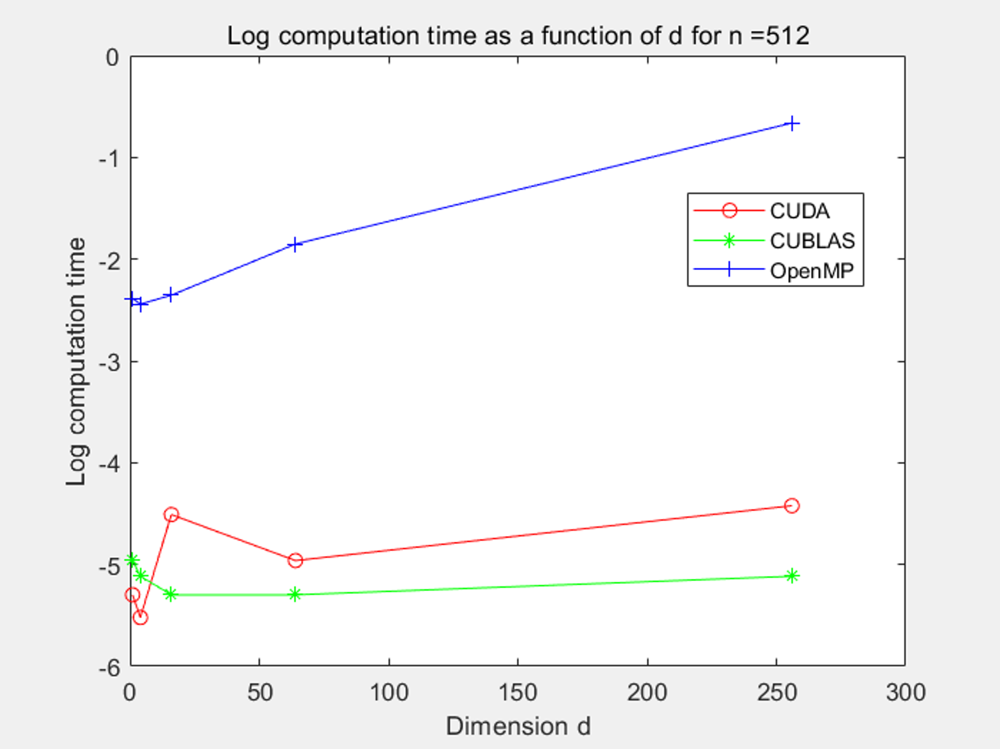
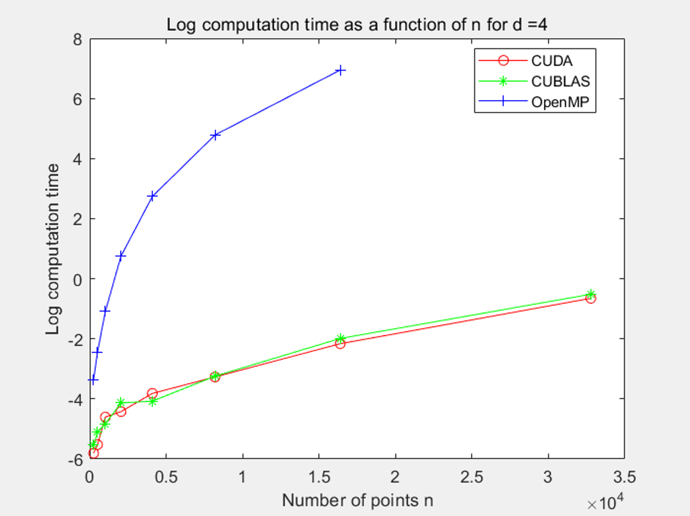
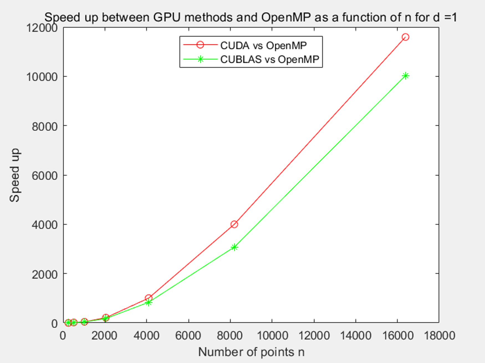

# 期末大作业报告

[toc]

---

## (一) 选题和目标

我们的选题：

- 使用 CUDA 对最近邻搜索算法进行并行化加速

经过调查相关资料和讨论，我们的预期目标是复现 Vincent Garcia 前后发表的两篇论文，并寻找其中可以优化的地方，来作出改进。这两篇论文是用 GPU 并行 kNN 穷举搜索法引用量最高的两篇，后一篇在前一篇的基础上，针对高维数据进行了改进。

- [Fast k Nearest Neighbor Search using GPU, Vincent Garcia](http://citeseerx.ist.psu.edu/viewdoc/download?doi=10.1.1.159.9386&rep=rep1&type=pdf)
  - 对排序部分进行改进，删减冗余操作，并同时获得搜索结果
- [k-Nearest Neighbor Search: Fast GPU-Based Implementations and Application to High-Dimensional Feature Space, Vincent Garcia](http://citeseerx.ist.psu.edu/viewdoc/download;jsessionid=064592F4CB50DE20D130694460A83334?doi=10.1.1.172.2896&rep=rep1&type=pdf)
  - 将问题变换成矩阵运算，使用 CUBLAS 加速
  - 对高维数据有更加优异的表现

我们项目的 github 仓库：

* https://github.com/lixk28/knn-cuda


## (二) 内容和方案

为了对比 kNN 在 CPU 和 GPU 上的表现，我们一共实现了 3 个版本的 kNN：

- kNN OpenMP (主要用于对比 CPU/GPU 性能表现)
  - OpenMP 并行计算距离矩阵
  - OpenMP 并行奇偶排序

- kNN CUDA (第一篇论文的实现)
  - CUDA 并行计算距离矩阵
  - CUDA 并行执行改进后的插入排序

- kNN CUBLAS (第二篇论文的实现)
  - CUBLAS 加速距离矩阵的计算
  - CUDA 并行执行改进后的插入排序


然后，通过设置不同的参数 (比如数据维数、数据量等)，来对比它们的运行时间、加速比。

项目分工：

|        成员         |                             工作                             |
| :-----------------: | :----------------------------------------------------------: |
| 19335109<br/>李雪堃 | kNN CUDA 版本和 kNN CUBLAS 版本的实现 (`knn.h` 和 `knn.cu`)<br/>项目的文件组织和构建 (https://github.com/lixk28/knn-cuda/issues/1 和 `makefile`) |
| 19335110<br/>李宜谦 | 使用共享内存优化矩阵计算，主程序逻辑和测试框架<br/>测试数据生成与结果收集、正确性检验、可视化分析 |
| 19335111<br/>李俞乐 |   kNN OpenMP 版本的实现、测试实验执行与结果收集、报告整合    |

## (三) 遇到的问题

* 在OpenMP实现版本中，若根据线程编号来进行任务分配，则有可能会导致最终的计算结果出现错误，这是由于CPU的最大线程数目有限，当查询点和参考点集合的规模较大，CPU 无法分配相同数量的线程，因此对于某些较大的线程编号，程序将无法指定一个线程来完成相应的计算任务。

- 关于 `cublasSgemm()` 的参数 (特别是 leading dimension) 和矩阵 column-major

  - 由于我们的矩阵都是 row-major，而 `cublasSgemm()` 默认矩阵是 column-major，所以在调用这个接口时，有很多坑和 trick

  - 我们需要计算的是 $C = -2XY^T$，`cublasSgemm()` 不仅默认输入矩阵是 column-major，输出矩阵也是如此，所以为了使结果 $C$ 是 row-major，我们实际上需要计算它的转置 $C^T = -2(XY^T)^T = -2YX^T$，这样就可以按 row-major 读取 $C$

  - 此外，它的参数 leading dimension 也非常 confusing，主维度的定义是两个连续的列 (或者行) 在内存中的距离，由于我们做了转置，实际上，我们传入的应该是矩阵列的数目 (而不是行)，刚开始我没有特别注意这一点，计算结果是错误的，调试了很久，查阅了相关博客和资料才找到原因

  - 最后调用为

    ```C
    float alpha = -2.0f;
    float beta  =  0.0f;
    cublasSgemm(handle, CUBLAS_OP_T, CUBLAS_OP_N, n, m, d, &alpha, y_d, d, x_d, d, &beta, dist_d, n);
    ```

  - 科学计算标准 `sgemm()` 非常灵活且高效，但随之带来的代价是复杂性高

  - 主要参考了 https://stackoverflow.com/questions/56043539/cublassgemm-row-major-multiplication 和 https://peterwittek.com/cublas-matrix-c-style.html 来搞清楚和解决了这个问题

## (四) 实验结果

### (1) 实验环境

* 我们测试的参数配置与论文中的实验配置一致
  * m = n = 256, 512, 1024, 2048, 4096, 8192, 16384, 32768;
  *  k = 20
  * d = 1, 4, 16, 64, 256
* 测试的数据为随机生成的范围在 [-500,500] 间的单精度浮点数

(下一页)

<div style="page-break-after: always;"></div>

### (2) CUDA使用共享内存优化前后的加速比

以下分别是使用共享内存与不使用共享内存方法的加速比关于点数 n 和维数 d 的变化趋势：

<center class="half">
    
    
</center>


* 当维数 d 较低 (<=32) 时，线程块对共享内存的写入不能满载，因此加速比小于 1，此时使用共享内存属于负优化。而随着维数 d 的增加，使用共享内存对于比较大的n都能起到加速作用，加速比也在持续上升，而对于特别小的 n (=512) ，加速比则有下降趋势，这可能是因为 n 较小时产生的线程较少，随着 d 的增加，每个线程的负载变大，整体的加速效果变差。
* 随着点数 n 的增加，维数 d 较大 (>=64) 的情况下加速比基本为快速增加、趋于稳定、出现减少趋势的过程，不过加速比都能保持在大于 1 即正优化。

### (3) 不同维度下 OpenMP、CUDA、CUBLAS 三种算法的运行时间比较

以下分别是点数n较小(=512)和较大(=16384)的情况下，运行时间的对数关于维度的变化趋势：

<center class="half">
    
    
</center>

二者的共同点是 OpenMP 的运行时间高于 CUDA 和 CUBLAS 多个量级，且随着维数 d 的增加，OpenMP 的运行时间处于增加状态，而 CUBLAS 在维度 d 较小时的性能甚至可能不如维度 d 较大时，但整体较稳定且优于 CUDA。二者的区别是 n 较大时，CUDA 随 d 增加而增加的趋势变得明显，而 CUBLAS 由于矩阵运算的优化，导致运行时间的提升并不明显，性能在维度大时更加优秀。

### (4) 不同点数下 OpenMP、CUDA、CUBLAS 三种算法的运行时间比较

以下分别是维数 d 较小 (=4) 和较大 (=256) 的情况下，运行时间的对数关于维度的变化趋势：

<center class="half">
    
    
</center>

二者的共同点仍是 OpenMP 的运行时间高于 CUDA 和 CUBLAS 多个量级 (由于 n=32768 时 OpenMP 的运行时间过于长，集群自动 kill 进程，因此未收集该数据)，且随着点数 n 的增加，三种方法的运行时间均会增加。二者的区别是 d 较小时，CUDA 和 CUBLAS 性能接近、互有优劣，而 d 较大时，CUDA 变得明显慢于 CUBLAS，再次印证了 CUBLAS 性能在维度大时更加优秀的结论。

### (5) CUDA、CUBLAS相较OpenMP的加速比

以下分别是维数 d 较小 (=1) 和较大 (=256) 的情况下，CUDA、CUBLAS 相较 OpenMP 的加速比关于点数 n 的变化趋势：

<center class="half">
    
    
</center>

可见，随着点数的增加，CUDA、CUBLAS 相比 OpenMP 方法的加速比均有所增加，也证明了对大规模数据，GPU 的高并行度使得 GPU 方法更明显地优于 CPU 方法。此外，对于低维度的数据，CUDA 有着更优秀的加速比，而对于高维度的数据，CUBLAS 的加速比明显远高于 CUDA。

从具体运行时间的角度也可以印证以上结论，以下是 n=32768 时 CUDA 和 CUBLAS 的运行时间 (单位为秒) 关于维度的变化趋势：

<center class="half">
    
</center>

可见，CUDA 的运行时间关于维数基本为线性增长，而 CUBLAS 在高维度下还能保持和低维度基本相近的运行时间，可见其在高维度数据下的优秀。

### (6) 实验结论

综上所述，对本次实现的三种方法的 performance 进行概括，可以得到如下结论：

* OpenMP 方法实现的 kNN 受限于 CPU 有限的并行度，无论对于大规模还是高维度的数据的性能均不甚理想；
* CUDA 方法实现的 kNN 相比 OpenMP 方法有明显的提升，且在维度较低性能优于 CUBLAS，是三者最佳；在维度较高时使用共享内存能够有一定程度的加速，但还是不及 CUBLAS 的性能；
* CUBLAS 方法实现的 kNN 相比 OpenMP 方法也有明显的提升，并且在维度较高时性能最佳，相比 CUDA 方法仍能有最高将近 20 倍的加速比。

## 附录：个人报告

### 19335111 李俞乐

#### kNN OpenMP 版本

kNN主要计算过程可以分为以下两个部分

* **计算查询点 `(query point)` 与参考点 `(reference point)` 之间的距离**

  * 实验中的距离使用的是欧氏距离，即 $distance (x, y) = ||x - y||_2^2$ ，假设 kNN 问题中查询点个数为 m， 参考点个数为 n，则需要计算一个 $m \times n$ 的距离矩阵，矩阵中的元素 $(i, j)$ 表示第 $i$ 个查询点和第 $j$ 个参考点之间的距离。

  * OpenMP并行化

    理想情况的并行方式是根据线程号来分配计算任务，每个线程负责一个查询点与一个参考点之间的距离计算。但是由于实验中查询点的数目 N 最大将会取到 32768，而CPU的可用线程数有限，因此在实现时仅是将常规实现代码中的嵌套循环使用 pragma 指令来并行化，即由 OpenMP 在运行时自行决定计算任务的分配。

  * `compute_distance`接口

    * 输入为查询点集和参考点集
    * 输出为 $m \times n$ 的距离矩阵

  ```C
  static void compute_distance(
      float *query,
      float *reference,
      float *distance,
      int m,
      int n,
      int d
  )
  {
      #pragma omp parallel for
      for(int i = 0; i < m; i++) {
          for(int j = 0; j < n; j++) {
              distance[i * n + j] = 0;
              for(int k = 0; k < d; k++) {
                  distance[i * n + j] +=
                      (query[i * d + k] - reference[j * d + k]) 
                      * (query[i * d + k] - reference[j * d + k]);
              }
              distance[i * n + j] = sqrtf(distance[i * n + j]);
          }
      }
  }
  ```

* **对距离矩阵和序号矩阵进行排序**

  * 通过对距离矩阵进行排序来挑选出与每个查询点距离最近的 k 个参考点，由于程序的输出是参考点的序号，因此在对距离矩阵的同时也需要对序号矩阵执行相同的操作。序号矩阵同样也是一个 $m \times n$ 矩阵，并且在初始情况下，序号矩阵的第 i 列的元素均为 i。

  * OpenMP并行化

    考虑到不同排序算法在OpenMP实现下的并行化效率，我在实验中使用了奇偶排序算法对两个矩阵进行排序。在理想情况下，奇偶排序算法的OpenMp实现会分配 $\frac{n}{2}$ 个线程用于执行排序操作，在每个排序阶段中，一个线程只需要对一个指定位置的元素及其相邻元素执行比较和交换操作即可，但是由于CPU可用线程数的限制，当参考点集的规模过大时，使用 `omp_set_num_threads(n/2)` 语句也无法实现 $\frac{n}{2}$ 个线程的分配，OpenMP 仅会在最大可用线程数的范围内为程序分配线程。接口最后的结果输出为两个长度为 k 的序列，因此程序的最后需要对排序后的序列截取和复制。

  * `odd_even_sort` 接口

    * 输入为长度为 n 的待排序序列，即距离矩阵和序号矩阵的某一行
    * 输出为长度为 k 的升序序列，即最近的 k 个参考点的序号以及相应的距离

  ```C
  static void odd_even_sort(float *row, float *row_res, int *indices, int n, int k)
  {
      int *indices_tmp = (int*)malloc(sizeof(int) * n);
  
      #pragma omp parallel for
      for(int i = 0; i < n; i++)
          indices_tmp[i] = i;
  
      int flag = 1;
  
      omp_set_num_threads(n / 2);
      while (flag) {
  
          flag = 0;
          #pragma omp parallel for
          for (int i = 0; i < n - 1; i += 2) {
              if (row[i] > row[i + 1]) {
                  flag = 1;
                  float temp = row[i];
                  row[i] = row[i + 1];
                  row[i + 1] = temp;
  
                  int temp2 = indices_tmp[i];
                  indices_tmp[i] = indices_tmp[i + 1];
                  indices_tmp[i + 1] = temp2;
              }
          }
  
          #pragma omp parallel for
          for (int i = 1; i < n - 1; i += 2) {
              if (row[i] > row[i + 1]) {
                  flag = 1;
                  float temp = row[i];
                  row[i] = row[i + 1];
                  row[i + 1] = temp;
  
                  int temp2 = indices_tmp[i];
                  indices_tmp[i] = indices_tmp[i + 1];
                  indices_tmp[i + 1] = temp2;
              }
          }
      }
  	
      //截取前k个元素
      #pragma omp parallel for
      for(int j = 0; j < k; j++) {
          row_res[j] = row[j];
          indices[j] = indices_tmp[j];
      }
  
  }
  ```

​		由于程序的目标结果是两个长度为 k 的序列，因此在程序的最后需要对两个长度为 n 的有序序列执行截取操作。

* `knn_omp`接口：kNN OpenMP 版本的封装接口

  ```C
  void knn_omp(
      float *x,
      float *y,
      int m,
      int n,
      int d,
      int k,
      int *knn_idx,
      float *knn_dist
  )
  {
      #pragma omp parallel for
      for(int i = 0; i < m; i++)
          for(int j = 0; j < k; j++)
              knn_idx[i * k + j] = j;
  
      float *distance = (float*)malloc(sizeof(float) * m * n);
      compute_distance(x, y, distance, m, n, d);
  
      #pragma omp parallel for
      for(int i = 0; i < m; i++)
          odd_even_sort(distance + i * n, knn_dist + i * k, knn_idx + i * k, n, k);
  }
  ```

  由于 CPU 的最大可用线程数目远小于 GPU ，因此在当查询点集和参考点集的规模较大以及维度较高时，每个线程所分配的计算任务将会远超过 GPU 的实现版本，因此性能表现上也将远远落后于 CUDA 版本。 

###  19335109 李雪堃

我在项目中的主要工作是实现了 kNN CUDA 版本和 kNN CUBLAS 版本，复现了 Vincent Garcia 两篇论文中的算法。

#### kNN CUDA 版本

kNN CUDA 版本的接口为 `knn.cu` 中的 `knn_cuda()` 函数：

```C
void knn_cuda(
    float *x,         // query points
    float *y,         // reference points
    int m,            // the number of query points
    int n,            // the number of reference points
    int d,            // point dimension
    int k,            // the number of neighbors
    int *knn_idx,     // indices of k-nearest neighbors
    float *knn_dist   // distance of k-nearest neighbors
);
```

`x` 和 `y` 分别是查询点和参考点，`m` 和 `n` 分别是查询点和参考点的数量，`d` 是点的维度，`k` 是邻居个数，`knn_idx` 和 `knn_dist` 分别是返回的 `k` 个最近邻的下标和距离。

`knn_cuda()` 中需要完成内存的申请、拷贝和释放，这里不赘述。`knn_cuda()` 的主要流程是依次调用两个核函数 `compute_distance()` 和 `k_selection_sort()`，它们的实现同样在 `knn.cu` 中，核函数的主要工作如下：

- `compute_distance()` 

  - 计算距离矩阵，线程数 `m * n`，可以完全并行
  - 查询点集 `x` 大小是 `m * d`，参考点集 `y` 大小是 `n * d`，点的维度是 `d`
  - 距离矩阵 `dist` 大小是 `m * n`，每行存储了 $x_i$ 到各个参考点的距离

  ```C
  __global__ void compute_distance(
      float *x_d,     // query points (stored in device memory)
      float *y_d,     // reference points (stored in device memory)
      int m,          // #query points (#rows of distance matrix)
      int n,          // #reference points (#cols of distance matrix)
      int d,          // point dimension
      float *dist_d   // distance matrix
  )
  {
      int row = blockDim.y * blockIdx.y + threadIdx.y;
      int col = blockDim.x * blockIdx.x + threadIdx.x;
  
      if (row < m && col < n) {
          float res = 0.0f;
          for (int i = 0; i < d; i++)
              res += (x_d[row * d + i] - y_d[col * d + i]) * (x_d[row * d + i] - y_d[col * d + i]);
          dist_d[row * n + col] = sqrtf(res);
      }
  }
  ```

- `k_selection_sort()`

  - 使用修改后的选择排序，对距离矩阵的每一行进行排序，线程数 `m`，每个线程负责一行
  - 因为对于每个查询点，我们只需要前 `k` 个最小的元素，如果前 `k` 个元素已经排好序，而且当前处理的值不小于第 `k` 个元素，那么我们就可以忽略它 (因为这个元素一定不会是前 `k` 个最小的)
  - 将结果存储在 `knn_idx_d` 和 `knn_dist_d` 中，并在排序过程中同时对它们进行插入排序的交换位置操作

  ```C
  __global__ void k_selection_sort(
      float *dist_d,    // distance matrix of size m x n
      int m,            // #rows of distance matrix
      int n,            // #cols of distance matrix
      int k,            // #neighbors
      int *knn_idx_d,   // indices of k-nearest neighbors (stored in device memory)
      float *knn_dist_d // distance of k-nearest neighbors (stored in device memory)
  )
  {
      int tid = blockDim.x * blockIdx.x + threadIdx.x;
  
      // each thread sort one row (corresponding to one query point)
      if (tid < m) {
          float *my_dist_d     = dist_d     + tid * n;
          int   *my_knn_idx_d  = knn_idx_d  + tid * k;
          float *my_knn_dist_d = knn_dist_d + tid * k;
  
          my_knn_idx_d[0]  = 0;
          my_knn_dist_d[0] = my_dist_d[0];
  
          for (int i = 1; i < n; i++) {
              int   curr_idx  = i;
              float curr_dist = my_dist_d[i];
  
              // if the top k elements has been sorted (which means that i >= k)
              // and current value is bigger than the k-th value
              // then we do not have to sort this value
              if (i >= k && curr_dist >= my_dist_d[k - 1])
                  continue;
  
              // shift values bigger than current value to the right
              // we 明显only have to shift the top k elements
              int j = min(i - 1, k - 2);
              while (j >= 0 && curr_dist < my_dist_d[j]) {
                  my_dist_d[j + 1]     = my_dist_d[j];
                  my_knn_idx_d[j + 1]  = my_knn_idx_d[j];
                  my_knn_dist_d[j + 1] = my_knn_dist_d[j];
                  j--;
              }
  
              // write current index and value
              my_dist_d[j + 1]     = curr_dist;
              my_knn_idx_d[j + 1]  = curr_idx;
              my_knn_dist_d[j + 1] = curr_dist;
          }
      }
  }
  ```

#### kNN CUBLAS 版本

点 $x$ 和 $y$ 之间的欧几里德距离可以表示为
$$
\rho(x, y) = \sqrt{||x - y||^2}
$$
两边平方，得到
$$
\begin{aligned}
\rho^2(x, y) 
&= ||x - y||^T||x - y|| \\
&= ||x||^2 + ||y||^2 - 2xy^T
\end{aligned}
$$
因此，距离矩阵的计算可以转换成矩阵运算
$$
\rho^2(X, Y) = N_X + N_Y - 2XY^T
$$

- $X$ 是查询点矩阵，大小 $m \times d$
- $Y$ 是参考点矩阵，大小 $n \times d$
- $N_X$ 大小 $m \times n$，它的第 $i$ 行元素都是 $||x_i||^2$，$x_i$ 是第 $i$ 个查询点
- $N_Y$ 大小 $m \times n$，它的第 $j$ 列元素都是 $||y_j||^2$，$y_j$ 是第 $j$ 个参考点

由于 $N_X$ 和 $N_Y$ 元素的重复性，我们可以用向量来存储，而不用真的去存整个矩阵。$-2XY^T$ 的计算可以用高度优化的 `cublasSgemm()` 来加速运算。然后再把 $N_X$ 和 $N_Y$ 加到上面。

kNN CUBLAS 版本的主要流程如下：

- 使用 CUDA 并行计算 $N_X$ 和 $N_Y$，分别是查询点和参考点的平方二范数向量
- 使用 CUBLAS 中的 `cublasSgemm()` 计算 $-2XY^T$
- 使用 CUDA 将 $N_X$ 和 $N_Y$ 加到 $-2XY^T$ 上，得到平方距离矩阵
- 使用 kNN CUDA 版本中的插入排序 kernel 对平方距离矩阵排序
- 使用 CUDA 对返回的 k 最近邻的距离 `knn_dist_d` 开方，得到真正的距离

kNN CUBLAS 版本的接口为 `knn_cublas()`，参数与 `knn_cuda()` 完全相同，同样在 `knn.cu` 中。下面是 CUBLAS 版本的核心代码。

```C
// compute squared norm vector vec_x_d of size 1 x m
// vec_x_d[i] is ||x_i||^2
compute_squared_norm_vector<<<divup(m, 256), 256>>>(x_d, m, d, vec_x_d);

// compute squared norm vector vec_y_d of size 1 x n
// vec_y_d[i] is ||y_i||^2
compute_squared_norm_vector<<<divup(n, 256), 256>>>(y_d, n, d, vec_y_d);

// use cublas sgemm to do matrix multiplication
cublasHandle_t handle;
cublasCreate(&handle);
float alpha = -2.0f;
float beta  =  0.0f;
cublasSgemm(handle, CUBLAS_OP_T, CUBLAS_OP_N, n, m, d, &alpha, y_d, d, x_d, d, &beta, dist_d, n);
cublasDestroy(handle);

// add squared norm vector to get the squared distance matrix
dim3 grid(divup(n, 32), divup(m, 32));
dim3 block(32, 32);
add_vector_to_matrix<<<grid, block>>>(dist_d, vec_x_d, vec_y_d, m, n);
  
// sort the distance matrix to get k smallest
k_selection_sort<<<divup(m, 256), 256>>>(dist_d, m, n, k, knn_idx_d, knn_dist_d);

// compute square root of knn_dist_d to get the real distance
compute_squared_root<<<divup(m * k, 256), 256>>>(knn_dist_d, m * k);
```

注意到，`cublasSgemm()` 加速的是 $-2XY^T$ 的运算，$X$ 的大小为 $m \times d$，$Y$ 的大小为 $n \times d$。

对于 kNN CUDA 版本，在计算距离矩阵时，每个线程需要计算 $d$ 个数的平方和，当 $d$ 比较大时，这么做肯定是不高效的。当我们转换成矩阵运算并使用 `cublasSgemm()` 后，每个线程要做的基本上只有将 $N_X$ 和 $N_Y$ 加到 $-2XY^T$ 上，`cublasSgemm()` 计算开销非常小。

因此，当数据维数较高时，kNN CUBLAS 版本要远远优于 kNN CUDA 版本，在我们上面的实验结果展示中，可以看到当 $d = 128$ 或更高时，或者 $m$、$n$ 较大时，加速比在 15 ～ 20 倍以上。

==另外值得一提的是==，原论文中没有将 kNN 的结果处理放到排序中同时进行，而是另外用一个核函数对距离矩阵进行切片，我将这个过程嵌入到了排序 kernel 中。此外，将 $N_X$ 和 $N_Y$ 加到 $-2XY^T$ 上也可以放到同一个 kernel 中，而原论文中是分别启动了两个 kernel。所以，我的复现中使用了更少的核函数，减少了一部分核函数的启动时间，比原论文更加高效。

总的来说，我们基本复现了论文提出的加速算法，并达到了和论文相同甚至更好的结果。

### 19335110 李宜谦

#### 使用共享内存优化距离矩阵的计算

优化思路分析：

baseline版本核函数中每个线程的工作：计算距离矩阵的一个元素 $dist[row][col]$ 的值。

主要优化的步骤：$dist[row][col] = sqrtf(\sum^{d-1}_{i=0}(x[row][i] - y[col[i]])^2)$

* 线程块需要的数据：$BDIM \times d \times 2$个
* 线程块读取全局内存总次数：$BDIM \times BDIM \times d \times 2$次

自然的想法是考虑将子矩阵读入共享内存，以便线程共享使用，注意到此时stride为1，不存在存储体冲突。

此时涉及到两个问题：

* 共享内存大小的确定。由于共享内存不支持用变量分配且当维度d增大时，由于大小有限，不能将所有 $BDIM \times d \times 2$ 个数据一次性读入共享内存（测试的最大情况为 d=256，BDIM=32）。因此将共享内存大小设置为 $BDIM \times BDIM$。这样读入共享内存的轮数 num 可用 `divup(d,  BDIM)` 确定
* 需要判断那些线程负责读入共享内存：当 d 不能被 BDIM 整除时，$id < d \ mod \  BDIM$ 的线程需要额外读入，此时其他线程应该将共享矩阵对应的元素置为0；当 d 能被 BDIM 整除时，所有线程都需要进行读入

代码如下

```C
__global__ void compute_distance_shared(
    float *x_d,     // query points (stored in device memory)
    float *y_d,     // reference points (stored in device memory)
    int m,          // #query points (#rows of distance matrix)
    int n,          // #reference points (#cols of distance matrix)
    int d,          // point dimension
    float *dist_d   // distance matrix
)
{
    int tx = threadIdx.x;
    int ty = threadIdx.y;
    int col = blockIdx.x * blockDim.x + tx;
    int row = blockIdx.y * blockDim.y + ty;
    __shared__ float shared_mat_x[1024], shared_mat_y[1024];
    int num = divup(d, 32), remain = d % 32 == 0 ? 32 : d % 32;
    int flag1 = row < m;
    int flag2 = col < n;
    float res = 0.0f;
    for (int i = 0; i < num; i++) {
        shared_mat_x[ty * 32 + tx] = (tx < remain && flag1) ? x_d[row * d + tx + 32 * i] : 0;
        shared_mat_y[tx * 32 + ty] = (tx < remain && flag1) ? y_d[col * d + ty + 32 * i] : 0;
        __syncthreads();
        if (flag1 && flag2) {
            for (int j = 0; j < 32; j++) {
                float tmp = shared_mat_x[ty * 32 + j] - shared_mat_y[tx * 32 + j];
                res += tmp * tmp;
            }
        }
        __syncthreads();
    }
    if (flag1 && flag2) {
        dist_d[row * n + col] = sqrtf(res);
    }
}
```

优化结果分析请参考小组报告中的实验结果部分。

#### 主程序逻辑

* 为了减小运行环境对时间造成的影响，将使用 CPU 的 OpenMP 版本与使用 GPU 的 CUDA、CUBLAS 版本在同一运行环境下比较
* 计时函数 `get_time()` 用 `timespec` 结构体获取当前时间并返回单位为毫秒的时间
* 测试的参数配置与论文[k-Nearest Neighbor Search: Fast GPU-Based Implementations and Application to High-Dimensional Feature Space, Vincent Garcia](http://citeseerx.ist.psu.edu/viewdoc/download;jsessionid=064592F4CB50DE20D130694460A83334?doi=10.1.1.172.2896&rep=rep1&type=pdf)一致
* 测试的数据为 `generate_data()` 随机生成的范围在 [-500,500] 间的单精度浮点数
* 每轮运行后将运行 `error_check()` 检测不同版本得到的结果是否一致
* 计时结束后将所有不同参数下三个版本的对应时间输出到 `time.txt` 中

#### 可视化部分

采用 MATLAB 进行可视化，比较遗憾的是我个人还不太会操作 github 仓库，核心代码的实现都是拜托同学帮我 push 到仓库中，遗漏了此部分，参考代码如下：

```matlab
A=load("time.txt");
B=log(A./1000);
cuda=B(1:8,:);
cublas=B(9:16,:);
omp=B(17:end,:);
cudaSpeedup=A(17:end,:)./A(1:8,:);
cublasSpeedup=A(17:end,:)./A(9:16,:);
dimension=[1,4,16,64,256];
number=[256,512,1024,2048,4096,8192,16384,32768];
for i=1:8
    plot(dimension,cuda(i,:),'ro-',dimension,cublas(i,:),'g*-',dimension,omp(i,:),'b+-');
    xlabel('Dimension d')
    ylabel('Log computation time')
    title(strcat('Log computation time as a function of d for n =  ',num2str(number(i))))
    legend('CUDA','CUBLAS','OpenMP','location','best')
    I = frame2im(getframe(gcf)); 
    J = imresize(I, [1312, 1750], 'bicubic');
    imwrite(J,strcat('dimension_',num2str(i),'.png'));
end
for j=1:5
    plot(number,cuda(:,j),'ro-',number,cublas(:,j),'g*-',number,omp(:,j),'b+-');
    xlabel('Number of points n')
    ylabel('Log computation time')
    title(strcat('Log computation time as a function of n for d =  ',num2str(dimension(j))))
    legend('CUDA','CUBLAS','OpenMP','location','best')
    I = frame2im(getframe(gcf)); 
    J = imresize(I, [1312, 1750], 'bicubic');
    imwrite(J,strcat('number_',num2str(j),'.png'));
    
    plot(number(1:7),cudaSpeedup(1:7,j),'ro-',number(1:7),cublasSpeedup(1:7,j),'g*-');
    xlabel('Number of points n')
    ylabel('Speed up')
    title(strcat('Speed up between GPU methods and OpenMP as a function of n for d =  ',num2str(dimension(j))))
    legend('CUDA vs OpenMP','CUBLAS vs OpenMP','location','north')
    I = frame2im(getframe(gcf)); 
    J = imresize(I, [1312, 1750], 'bicubic');
    imwrite(J,strcat('speedup_',num2str(j),'.png'));
end
B=load("time_shared.txt");
cuda=B(1:8,:);
cuda_s=B(17:24,:);
cudaSpeedup=cuda./cuda_s;
plot(dimension,cudaSpeedup(2,:),'ro-',dimension,cudaSpeedup(4,:),'g*-',dimension,cudaSpeedup(6,:),'b+-',dimension,cudaSpeedup(8,:),'ch-');
xlabel('Dimension d')
ylabel('Speed up')
title('Speed up of using shared memory as a function of d for different n')
legend('n = 512','n = 2048','n = 8192','n = 32768','location','best')
I = frame2im(getframe(gcf)); 
J = imresize(I, [1312, 1750], 'bicubic');
imwrite(J, 'dimension_shared_speedup.png');
  
plot(number,cudaSpeedup(:,1),'ro-',number,cudaSpeedup(:,2),'g*-',number,cudaSpeedup(:,3),'b+-',number,cudaSpeedup(:,4),'ch-',number,cudaSpeedup(:,5),'kp-');
xlabel('Number of points n')
ylabel('Speed up')
title('Speed up of using shared memory as a function of n for different d')
legend('d = 1','d = 4','d = 16','d = 64','d = 256','location','best')
I = frame2im(getframe(gcf)); 
J = imresize(I, [1312, 1750], 'bicubic');
imwrite(J,'number_shared_speedup.png');

```


